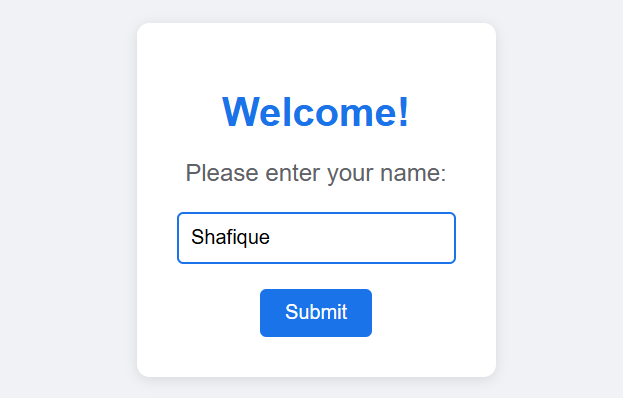
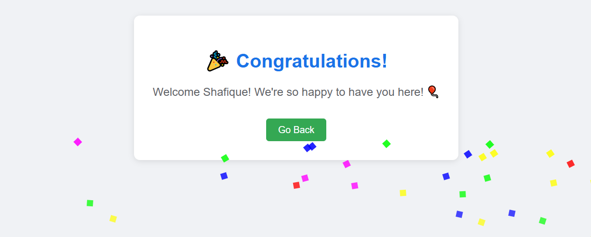

# Interactive Welcome Page 🎉

A modern, interactive welcome page that creates a delightful user experience with animations, confetti effects, and keyboard interactions. Built with pure HTML, CSS, and JavaScript, this project demonstrates how to create engaging web interactions without any external dependencies.

## 📸 Screenshots


*Initial welcome screen with name input*


*Celebration screen with confetti animation*

## 🌟 Features

- **Interactive Name Input**
  - Clean, modern input field with focus states
  - Real-time validation
  - Placeholder text for better UX

- **Celebration Animation**
  - Colorful confetti animation
  - Multiple waves of confetti effects
  - Smooth pop-in transitions
  - Personalized welcome message

- **Keyboard Navigation**
  - `Enter` key to submit name
  - `Escape` key to return to input form
  - Fully accessible keyboard interactions

- **Modern UI Design**
  - Google Material Design-inspired color scheme
  - Responsive layout
  - Smooth hover effects
  - Clean typography
  - Card-based design with subtle shadows

## 🚀 Technologies Used

- **HTML5**
  - Semantic markup
  - Modern document structure
  - Viewport meta tags for responsiveness

- **CSS3**
  - Flexbox for centering and layout
  - CSS Animations (@keyframes)
  - CSS Transitions
  - Custom button styling
  - Mobile-responsive design

- **Vanilla JavaScript**
  - DOM manipulation
  - Event listeners
  - Dynamic content generation
  - Timeout and interval handling
  - Form validation

## 🎨 Design Choices

- **Color Scheme**
  - Primary Blue (#1a73e8) - Main actions and highlights
  - Success Green (#34a853) - Back button
  - Light Gray (#f0f2f5) - Background
  - White - Card background
  - Multiple colors for confetti

- **Typography**
  - Arial/sans-serif for clean, modern look
  - Responsive font sizes
  - Appropriate line heights and spacing

## 🛠️ Setup and Usage

1. Clone the repository:
   ```bash
   git clone https://github.com/cswiz2003/interactive-welcome-page.git
   ```

2. Open `index.html` in your web browser

No build process or dependencies required! The project works out of the box.

## 💻 How to Use

1. Open the page in your browser
2. Enter your name in the input field
3. Submit using either:
   - Click the "Submit" button
   - Press the `Enter` key
4. Enjoy the celebration animation!
5. Return to the form using either:
   - Click the "Go Back" button
   - Press the `Escape` key

## 🌐 Browser Support

- Chrome (latest)
- Firefox (latest)
- Safari (latest)
- Edge (latest)
- Opera (latest)

## 📱 Responsive Design

The page is fully responsive and works well on:
- Desktop computers
- Tablets
- Mobile phones

## 🤝 Contributing

Contributions are welcome! Feel free to:
1. Fork the repository
2. Create a new branch
3. Make your changes
4. Submit a pull request

## 📜 License

This project is open source and available under the [MIT License](LICENSE).

## 🙏 Acknowledgments

- Inspired by modern web design practices
- Color scheme inspired by Google's Material Design
- Animation techniques inspired by modern UX patterns

## 📞 Contact

If you have any questions or suggestions, feel free to open an issue or submit a pull request.

---
Made with ❤️ by [Shafique Ahmed] 
